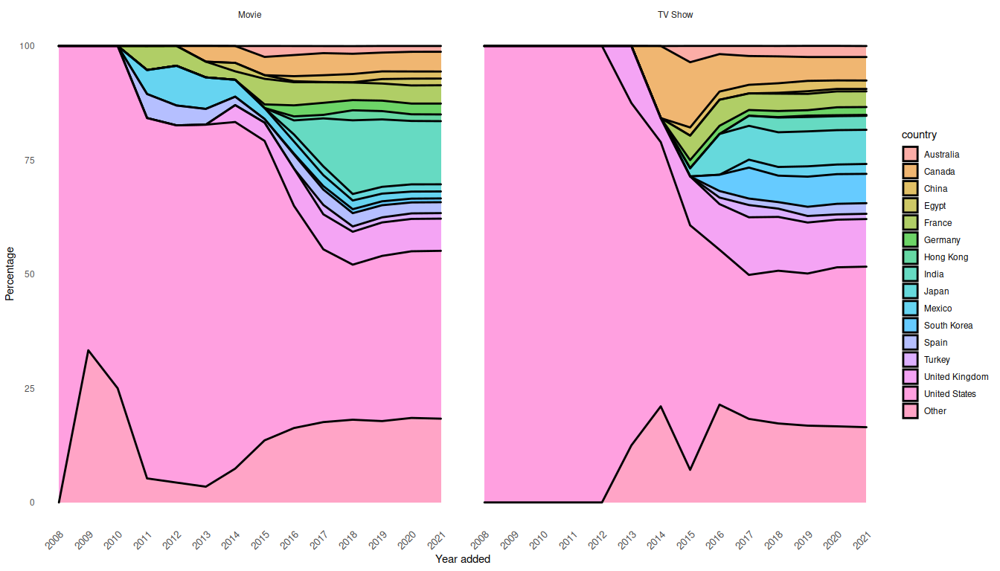

# Packages

```r
# library(ggpubr)
library(directlabels)
library(colorRamps)
library(grid)
library(tidyverse)
```

```
## ── Attaching packages ─────────────────────────────────────── tidyverse 1.3.0 ──
```

```
## ✓ ggplot2 3.3.0     ✓ purrr   0.3.4
## ✓ tibble  3.0.4     ✓ dplyr   1.0.2
## ✓ tidyr   1.1.0     ✓ stringr 1.4.0
## ✓ readr   1.3.1     ✓ forcats 0.5.0
```

```
## ── Conflicts ────────────────────────────────────────── tidyverse_conflicts() ──
## x dplyr::filter() masks stats::filter()
## x dplyr::lag()    masks stats::lag()
```

# Import data

```r
netflix_titles <- readr::read_csv('https://raw.githubusercontent.com/rfordatascience/tidytuesday/master/data/2021/2021-04-20/netflix_titles.csv')
```

```
## Parsed with column specification:
## cols(
##   show_id = col_character(),
##   type = col_character(),
##   title = col_character(),
##   director = col_character(),
##   cast = col_character(),
##   country = col_character(),
##   date_added = col_character(),
##   release_year = col_double(),
##   rating = col_character(),
##   duration = col_character(),
##   listed_in = col_character(),
##   description = col_character()
## )
```

# Turn df into wide form
Put countries from movie/show with multiple countries in their own variable.  

```r
year_country <- netflix_titles %>% 
  drop_na(country, date_added) %>% 
  separate(country, c("country1", "country2", "country3", "country4", "country5", "country6", "country7", "country8", "country9", "country10", "country11", "country12"), sep = ", ") %>% 
  separate(date_added, c("date_added", "year_added"), sep = ", ") %>% 
  select(year_added, starts_with("country"), show_id, type) %>% 
  print()
```

```
## Warning: Expected 12 pieces. Missing pieces filled with `NA` in 7270 rows [1, 2,
## 3, 4, 5, 6, 7, 8, 9, 10, 11, 12, 13, 14, 15, 16, 17, 18, 19, 20, ...].
```

```
## # A tibble: 7,271 x 15
##    year_added country1 country2 country3 country4 country5 country6 country7
##    <chr>      <chr>    <chr>    <chr>    <chr>    <chr>    <chr>    <chr>   
##  1 2020       Brazil   <NA>     <NA>     <NA>     <NA>     <NA>     <NA>    
##  2 2016       Mexico   <NA>     <NA>     <NA>     <NA>     <NA>     <NA>    
##  3 2018       Singapo… <NA>     <NA>     <NA>     <NA>     <NA>     <NA>    
##  4 2017       United … <NA>     <NA>     <NA>     <NA>     <NA>     <NA>    
##  5 2020       United … <NA>     <NA>     <NA>     <NA>     <NA>     <NA>    
##  6 2017       Turkey   <NA>     <NA>     <NA>     <NA>     <NA>     <NA>    
##  7 2020       Egypt    <NA>     <NA>     <NA>     <NA>     <NA>     <NA>    
##  8 2019       United … <NA>     <NA>     <NA>     <NA>     <NA>     <NA>    
##  9 2019       India    <NA>     <NA>     <NA>     <NA>     <NA>     <NA>    
## 10 2017       India    <NA>     <NA>     <NA>     <NA>     <NA>     <NA>    
## # … with 7,261 more rows, and 7 more variables: country8 <chr>, country9 <chr>,
## #   country10 <chr>, country11 <chr>, country12 <chr>, show_id <chr>,
## #   type <chr>
```
Although I don't use show_id or type for the main figure, I kept them anyway, to be able to for instance split up the figure based on movie/TV show (`type`).  

# Turn df into long form
Every country entry gets its own row. This does mean that movies/shows with multiple production countries impact the data more, and therefore the final figure. Since I mainly focused on the final figure and how to get to it, I mostly ignored this data bias.  

```r
year_country_long <- year_country %>% 
  pivot_longer(cols = starts_with("country"),
               names_to = "country_n",
               values_to = "country") %>% 
  drop_na(country) %>% 
  select(-country_n) %>% 
  mutate_at(vars(year_added, country, type), list(as.factor)) %>% 
  arrange(year_added, country) %>% 
  print()
```

```
## # A tibble: 9,054 x 4
##    year_added show_id type    country      
##    <fct>      <chr>   <fct>   <fct>        
##  1 2008       s1766   TV Show United States
##  2 2008       s7114   Movie   United States
##  3 2009       s3249   Movie   Denmark      
##  4 2009       s5766   Movie   United States
##  5 2010       s3841   Movie   United States
##  6 2011       s2042   Movie   France       
##  7 2011       s2042   Movie   Mexico       
##  8 2011       s2042   Movie   Spain        
##  9 2011       s233    Movie   United States
## 10 2011       s309    Movie   United States
## # … with 9,044 more rows
```

```r
summary(year_country_long)
```

```
##    year_added     show_id               type                country    
##  2019   :2423   Length:9054        Movie  :6609   United States :3290  
##  2020   :2354   Class :character   TV Show:2445   India         : 990  
##  2018   :1958   Mode  :character                  United Kingdom: 721  
##  2017   :1451                                     Canada        : 412  
##  2016   : 553                                     France        : 349  
##  2021   : 134                                     Japan         : 286  
##  (Other): 181                                     (Other)       :3006
```

# Prepare proportional stacked area chart
To create the proportional stacked area chart, I needed percentages per country. To get those, I first created a variable with counts per country, then cumulative counts, and then percentages.  
Since there were 121 countries - way too many for the plot I had in mind - I lumped the majority of the countries into a variable called `Other`, only keeping the top 15 countries.  

```r
# count per country per year
year_country_count <- year_country_long  %>%
  # group_by(year_added) %>%
  mutate(country = fct_lump(country, 15)) %>%
  group_by(year_added) %>%
  count(country)

# make sure every country has a row for each year
year_country_count <- year_country_count %>% 
  pivot_wider(names_from = year_added, values_from = n) %>% 
  replace(is.na(.), 0) %>% 
  pivot_longer(cols = -country, names_to = "year_added", values_to = "n") %>% 
  mutate_at(vars(year_added), list(as.numeric)) %>% 
  arrange(year_added)

# add cumulative counts per year per country
year_country_count <- year_country_count %>% 
  group_by(country) %>%
  mutate("cum_n" = cumsum(n))

# add percentage per year per country
year_country_count <- year_country_count %>% 
  group_by(year_added) %>%
  mutate(percentage = round(cum_n / sum(cum_n) *100, 2)) %>% 
  ungroup()
```

To get the direct labels on the right hand side of the plot at the right vertical location, I created this `label_loc` df.  

```r
label_loc <- year_country_count %>% 
   filter(year_added == max(year_added)) %>% 
   arrange(desc(country)) %>% 
   mutate(cumperc = cumsum(percentage)) %>% 
   mutate(label_loc = cumperc - (0.5 * percentage) ) %>% 
   arrange(country) %>% 
   print()
```

```
## # A tibble: 16 x 7
##    country        year_added     n cum_n percentage cumperc label_loc
##    <fct>               <dbl> <int> <int>      <dbl>   <dbl>     <dbl>
##  1 Australia            2021     1   143       1.58   100.      99.2 
##  2 Canada               2021     8   412       4.55    98.4     96.1 
##  3 China                2021     0   147       1.62    93.9     93.0 
##  4 Egypt                2021     0   110       1.21    92.2     91.6 
##  5 France               2021     7   349       3.85    91.0     89.1 
##  6 Germany              2021     4   199       2.2     87.2     86.1 
##  7 Hong Kong            2021     2   102       1.13    85.0     84.4 
##  8 India                2021    13   990      10.9     83.8     78.4 
##  9 Japan                2021     1   286       3.16    72.9     71.3 
## 10 Mexico               2021     2   154       1.7     69.8     68.9 
## 11 South Korea          2021     1   212       2.34    68.1     66.9 
## 12 Spain                2021     3   215       2.37    65.7     64.5 
## 13 Turkey               2021     1   108       1.19    63.3     62.7 
## 14 United Kingdom       2021     8   721       7.96    62.2     58.2 
## 15 United States        2021    74  3290      36.3     54.2     36.0 
## 16 Other                2021     9  1616      17.8     17.8      8.93
```

# Create proportional stacked area chart
This is the final bit of code to create the main figure, and all customization.  

```r
# Plot
p1 <- year_country_count %>% 
  ggplot(aes(x = year_added, y = percentage, fill = country)) + 
  # scale_fill_manual(values = matlab.like2(16) ) + # original colors I wanted to use - did not work on white or black background
  scale_fill_manual(values = terrain.colors(16) ) +
  geom_area(alpha = 1 , size = 1, colour = "black") +
  theme_minimal() +
  # edit the look of the plot
  theme(panel.grid.major = element_blank(), # remove grid
        panel.grid.minor = element_blank(), # remove grid
        plot.background = element_rect(fill = "black"),
        axis.text = element_text(color = "white", size = 12, family = "sans"),
        title = element_text(colour = "white", size = 14),
        plot.title = element_text(size = 20, family = "sans"), # change plot title
        axis.title.x = element_text(margin = margin(15, 0, 0, 0) ), # increase margin above x-axis title
        plot.margin = unit(c(1, 5, 1, 1), "cm"), # change canvas margin on the right
        axis.text.y = element_text(hjust = 1, 
                                   margin = margin(0, -30, 0, 0)), # change margin to the right of axis text - move closer to plot
        axis.text.x = element_text(size = 12, 
                                   angle = 45,  # change orientation of x-axis labels
                                   hjust = 1, 
                                   vjust = 1, 
                                   margin = margin(-15, 0, 0, 0))) + # change margin above axis text - move closer to plot
  scale_x_continuous("Year added", breaks = unique(year_country_count$year_added)) + # add x-axis title and label every year
  labs(title = "Country where NETFLIX movie/show was produced",
       subtitle = "Progression, over the years",
       y = "Percentage of total countries",
       caption = "based on data from Kaggle, provided via TidyTuesday, 2021 week 17") +
  # add direct labels to the right of the plot
  geom_dl(data = label_loc, aes(label = country, y = label_loc, x = year_added + 0.1, colour = country), position = "identity", method = list("last.points", cex = 0.75)) +
  scale_color_manual(values = terrain.colors(16) ) + # give direct labels same colours as plot area
  guides(fill = FALSE, colour = FALSE) # turn off legend

# Code to turn off clipping
gt1 <- ggplotGrob(p1)
gt1$layout$clip[gt1$layout$name == "panel"] <- "off"
grid.draw(gt1)
```

<!-- -->


```r
plot(gt1)
```

<!-- -->

## Save plot

```r
png(filename = "netflix_figure.png", width = 1440, height = 960)
plot(gt1)
dev.off()
```

```
## png 
##   2
```

# Create proportional stacked area charts, faceted based on Movie/TV show
These plots are without all of the customization of the main figure.  

```r
# create percentages per country
year_country_count <- year_country_long  %>%
  # group_by(year_added) %>%
  mutate(country = fct_lump(country, 15)) %>% 
  group_by(year_added, type) %>%
  count(country)

year_country_count <- year_country_count %>% 
  pivot_wider(names_from = year_added, values_from = n) %>% 
  replace(is.na(.), 0) %>% 
  pivot_longer(cols = -c(country, type), names_to = "year_added", values_to = "n") %>% 
  mutate_at(vars(year_added), list(as.numeric)) %>% 
  arrange(year_added)

year_country_count <- year_country_count %>% 
  group_by(type, country) %>%
  mutate("cum_n" = cumsum(n))

year_country_count <- year_country_count %>% 
  group_by(type, year_added) %>%
  mutate(percentage = round(cum_n / sum(cum_n) *100, 2)) %>% 
  ungroup()

# Plot
year_country_count %>% 
  ggplot(aes(x = year_added, y = percentage, fill = country)) + 
  geom_area(alpha = 0.6 , size = 1, colour = "black") +
  theme_minimal() +
  # Remove panel grid lines
  theme(panel.grid.major = element_blank(),
        panel.grid.minor = element_blank(),
        axis.text.x = element_text(size = 10, angle = 45, hjust = 1, vjust = 1) ) + # change orientation of x-axis labels
  scale_x_continuous("Year added", breaks = unique(year_country_count$year_added)) +
  labs(y = "Percentage") +
  facet_wrap(vars(type))
```

<!-- -->


